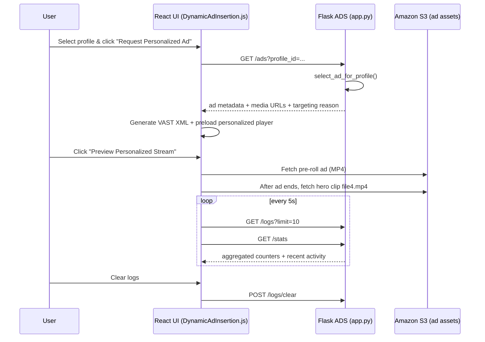

# Dynamic Ad Insertion – Architecture & Logic Reference

## 1. Purpose & Scope
This guide captures the end-to-end architecture for the Dynamic Ad Insertion (DAI) experience inside MediaGenAI. It explains how the Flask Ad Decision Server (ADS) in `dynamicAdInsertion/app.py` collaborates with the React UI in `frontend/src/DynamicAdInsertion.js` to deliver personalized pre-roll ads, log activity, and expose operational insights.

Use this document when you:
- Need to modify ad selection logic or expand the profile/ad catalogue.
- Integrate the DAI experience into another client or automate tests.
- Operate the service in different environments (dev, staging, prod).
- Onboard new contributors who need architectural context.

## 2. High-Level Summary
- **What it does:** Simulates an end-to-end SSAI (Server-Side Ad Insertion) pipeline. Users pick viewer personas, request ads, preview stitched playback (ad followed by hero clip), inspect ad metadata/VAST XML, and review real-time logs and stats.
- **Where it runs:**
  - Flask backend on port `5010` acting as the Ad Decision Server.
  - React frontend page under the Dynamic Ad Insertion route.
  - Static assets (architecture diagram, hero video) served from `frontend/public`.
- **Key integrations:** AWS S3 for hosting ad creatives (mocked via public URLs) and reference diagram; no live connection to MediaTailor or SSPs yet, but the API contracts mimic an ADS.

### 2.1 Sequence Overview


## 3. Backend Service (`dynamicAdInsertion/app.py`)

### 3.1 Technology Stack & Configuration
- **Framework:** Flask with CORS enabled for local React access.
- **Environment Variables:**
  - `AWS_REGION` (default `us-east-1`).
  - `DAI_S3_BUCKET` (default `mediagenai-ad-insertion`) used to compose HLS/thumbnail URLs.
- **Data Stores:** In-memory dictionaries for profiles (`USER_PROFILES`), ad inventory (`AD_INVENTORY`), and request history (`AD_REQUEST_LOGS`). No external database currently.
- **Logging:** Python logging at INFO level. Emits selection decisions and errors to stdout (captured in `dynamic-ad-insertion.log`).

### 3.2 Core Endpoints
| Endpoint | Method | Purpose | Notes |
|----------|--------|---------|-------|
| `/health` | GET | Service heartbeat | Returns AWS region and bucket info. |
| `/ads` | GET | Primary ad decision endpoint | Accepts `profile_id` and optional `session_id`; returns best match ad metadata. |
| `/profiles` | GET | List available viewer personas | Used to populate selector UI. |
| `/profiles/<id>` | GET | Fetch persona details | Supplies demographics/interests for sidebar card. |
| `/ads/inventory` | GET | Retrieve full ad catalogue | Useful for admin tooling/tests. |
| `/logs` | GET | Return recent ad request logs | Supports `limit` query param; default 50. |
| `/logs/clear` | POST | Reset ad request logs | Used by UI “Clear Logs” button. |
| `/stats` | GET | Aggregate metrics | Provides totals, unique sessions, counts by category/profile. |

### 3.3 Ad Selection Logic
`select_ad_for_profile(profile_id)` implements a simple scoring system:
1. Retrieves profile metadata from `USER_PROFILES` (defaults to fallback if unknown).
2. Iterates through `AD_INVENTORY` (excluding `default_ad`).
3. For each ad, increments score by 10 for every overlapping interest.
4. Adds +5 if ad specifies a non-`All` age range (basic demographic weighting).
5. Chooses highest scoring ad; if score < 5, falls back to `default_ad`.
6. Logs the result with profile name and score for observability.

_Enhancements to consider:_ incorporate location, view history, frequency capping, or integrate an external ML ranking model.

### 3.4 Response Payload
Example `/ads` response:
```json
{
  "ad_id": "gaming_console_ad",
  "ad_name": "Next-Gen Gaming Console",
  "duration": 10,
  "category": "Gaming",
  "video_url": "https://.../output.mp4",
  "hls_url": "https://.../playlist.m3u8",
  "thumbnail": "https://.../thumb.jpg",
  "targeting_reason": "Matched interests: Gaming, Esports, Technology",
  "session_id": "session_1698162200000"
}
```
Fields consumed by the frontend:
- `video_url` → personalized pre-roll stream (MP4) used for demo.
- `thumbnail` → poster image for player.
- `targeting_reason` → displayed under Ad Information.
- `session_id` → stored in logs for stats.

### 3.5 Logging & Metrics
- **Logs (`AD_REQUEST_LOGS`):** Append-only list of `{timestamp, session_id, profile_id, ad_id, ad_name, ad_category, duration}`.
  - Trimmed to 100 entries to prevent unbounded growth.
  - `/logs` endpoint returns most recent first (UI reverses to show latest at top).
- **Stats:** Derived on the fly when `/stats` is called. Tracks:
  - Total requests served.
  - Unique session count.
  - Distribution by ad category and profile.

### 3.6 Error Handling
- Unknown profile IDs fallback gracefully to default ad.
- Unexpected exceptions in `/ads` return 500 with error message.
- Missing profile in `/profiles/<id>` yields 404.
- Logs are cleared atomically by replacing list reference.

### 3.7 Security & Production Considerations
- **Authentication:** None; add API keys/JWT if exposing publicly.
- **Rate limiting:** Not implemented—proxy (API Gateway, ALB) should handle in production.
- **Persistence:** All state is memory-backed—restart loses logs/stats. Persist to DynamoDB or RDS for durability.
- **Creative storage:** URLs point to S3; ensure CORS allows browser playback if using HLS.
- **Extensibility:** Replace static `AD_INVENTORY` with ingestion from CMS or ad server via REST/GraphQL.

## 4. Frontend Client (`frontend/src/DynamicAdInsertion.js`)

### 4.1 Page Layout Overview
The page is a two-column grid:
- **Top full-width card:** Reference architecture diagram (`public/dai-architecture.png`).
- **Left column:**
  - Profile selector and details card.
  - Ad Information & Preview card (visible once ad is fetched).
- **Right column:**
  - Statistics card summarizing aggregate metrics.
  - Logs card listing recent ad decisions with clear button.

### 4.2 Core React State & Hooks
| State Variable | Purpose |
|----------------|---------|
| `profiles` | List of personas fetched from `/profiles`. |
| `selectedProfile` | Currently selected profile ID. |
| `profileDetails` | Expanded demographics/interests. |
| `currentAd` | Latest ad response (with cache-busted `video_url`). |
| `message` | Toast-style status banner (info/success/error). |
| `logs` / `stats` | Telemetry fetched every 5 seconds. |
| `vastXml` | Generated VAST 4.0 markup for the selected ad. |
| `playbackPhase` | `idle | ready | ad | content` to drive status text. |
| `personalizedSource` | Current `<source>` URL inside the preview player. |
| `playbackKey` | Forces `<video>` to reload when switching sources. |

`useEffect` on mount triggers `loadProfiles`, `loadLogs`, `loadStats`, then schedules a 5-second interval to refresh logs/stats.

### 4.3 Pre-Roll Preview Flow
1. User selects a profile → `handleProfileChange` loads persona details and resets player state.
2. User clicks **Request Personalized Ad** → `handleRequestAd` calls `/ads`, adds cache-buster query to avoid browser caching, stores ad, generates VAST XML, updates logs/stats.
3. The preview button becomes active. Clicking it calls `handlePlayPersonalizedStream`, which loads the ad MP4 into `<video>` and starts playback (`playbackPhase = 'ad'`).
4. `onEnded` handler detects ad completion and automatically swaps source to hero clip (`/dai-content.mp4`), representing the primary stream.
5. After hero clip ends, player resets to ready state with ad cached (user can replay).
6. Status banner below button reflects current phase (ready/ad/content) for clarity.

### 4.4 VAST XML Generation
`generateVastXml(ad)` builds a VAST 4.0 inline response embedding tracking pixels and click-through URLs pointing at the Flask ADS (`/tracking/{event}/{adId}` etc.). These endpoints are currently illustrative; implement them in the backend for full beacon handling.

### 4.5 Logs & Stats UI
- Logs are rendered newest-first with timestamp, profile, ad name, category, duration.
- **Clear Logs** button prompts confirmation and calls `/logs/clear`.
- Stats card shows `total_requests`, `unique_sessions`, and number of categories served. You can extend the UI to chart the full `ads_by_category` map.

### 4.6 Assets & Static Files
- `public/dai-architecture.png`: Imported from backend folder (`dynamicAdInsertion/Designer.png`) and displayed on the page.
- `public/dai-content.mp4`: Base hero content clip (`file4.mp4`) copied from backend asset library.
- Ensure both files are bundled with the frontend build; restart dev server after changes.

### 4.7 Error Handling & UX Details
- Messages appear in a central banner. Autoplay failure triggers info message instructing user to click Play manually.
- If `/ads` request errors, message is shown and player remains idle.
- Player uses `controls={Boolean(personalizedSource)}` to hide controls until a source is available, preventing blank UI.
- Profile change resets ad state and instructs user to fetch a new ad.

## 5. Data & Control Flow Deep Dive

### 5.1 `/ads` Request Lifecycle
1. React requests `GET /ads?profile_id=<persona>&session_id=session_<timestamp>`.
2. Flask scores ads, logs the decision, and returns JSON payload.
3. React appends `?t=<Date.now()>` to `video_url` for cache busting.
4. VAST XML is generated client-side for demonstration and optionally copied.
5. Logs/stats refreshed via `loadLogs()`/`loadStats()` to reflect new call.

### 5.2 Log Storage Structure
```
AD_REQUEST_LOGS = [
  {
    "timestamp": "2025-10-24T10:04:02.123456",
    "session_id": "session_1698162200000",
    "profile_id": "gamer",
    "profile_name": "Gamer",
    "ad_id": "gaming_console_ad",
    "ad_name": "Next-Gen Gaming Console",
    "ad_category": "Gaming",
    "duration": 10
  },
  ...
]
```

### 5.3 Stats Shape
```
{
  "total_requests": 12,
  "unique_sessions": 10,
  "ads_by_category": {
    "Gaming": 4,
    "Sports & Fitness": 3,
    ...
  },
  "ads_by_profile": {
    "Gamer": 4,
    "Sports Fan": 3,
    ...
  }
}
```
Extend the frontend to graph these distributions or persist them in external analytics (QuickSight, Looker) for richer dashboards.

## 6. Deployment & Environment Notes
- **Backend:** Run locally with `python3 dynamicAdInsertion/app.py`. For production, wrap in `gunicorn`/`uwsgi` and place behind reverse proxy.
- **Frontend:** `npm start` for dev or `npm run build` for deployment. Ensure build pipeline copies `dai-architecture.png` and `dai-content.mp4`.
- **Service integration:** If hosting both apps, configure the frontend to point `BACKEND_URL` at deployed ADS base URL. For prod, shift to environment-based configuration instead of hard-coded `localhost`.
- **Monitoring:** Add structured logging (JSON) or integrate with CloudWatch Logs for long-term visibility. Consider hooking `/logs` data into Kinesis Firehose → QuickSight as shown on the page.
- **Scaling:** In-memory state means multi-instance deployments require a shared store (Redis, DynamoDB) for logs/stat consistency.

## 7. Extensibility & Roadmap Ideas
- **Real ADS integration:** Replace mock inventory with runtime fetch from an SSP or ad server (FreeWheel, Google Ad Manager) using OpenRTB or proprietary APIs.
- **MediaTailor alignment:** Convert the demo player to fetch stitched manifests from AWS Elemental MediaTailor using the returned session token.
- **Beacon endpoints:** Implement `/tracking/*`, `/impression/*`, `/click/*` routes in Flask to log metrics, then surface them in stats.
- **Personalization model:** Swap scoring logic for Amazon Personalize or Bedrock-based ranking to support real-time contextual signals.
- **Ad lifecycle management:** Build admin UI to upload new creatives to S3 and update inventory JSON dynamically.
- **User authentication:** Tie profiles to authenticated users and store preferences.

## 8. Quick Start Checklist
1. **Prereqs:** Python 3.11+, Node 18+, AWS credentials (optional if using hosted assets).
2. **Backend:**
   ```bash
   export AWS_REGION=us-east-1
   export DAI_S3_BUCKET=mediagenai-ad-insertion
   python3 dynamicAdInsertion/app.py
   ```
3. **Frontend:**
   ```bash
   cd frontend
   npm install
   npm start
   ```
4. **Test Flow:**
   - Navigate to Dynamic Ad Insertion page.
   - Select a persona (e.g., Gamer), request an ad.
   - Click “Preview Personalized Stream” → confirm ad plays before hero clip.
   - Review logs/stats updating in right column.
   - Copy VAST XML and validate structure if needed.

## 9. Ownership & Operational Contacts
- **Service owner:** MediaGenAI Streaming Innovation squad.
- **Primary modules:** `dynamicAdInsertion/app.py`, `frontend/src/DynamicAdInsertion.js`.
- **Static assets:** `frontend/public/dai-architecture.png`, `frontend/public/dai-content.mp4`.
- **Logs:** Backend writes to `dynamic-ad-insertion.log`; frontend console logs show player events.
- **Support tools:** Scripts under `dynamicAdInsertion/` (e.g., `generate_all_ads.py`) bootstrap creative assets.

---
*Last updated:* 24 Oct 2025
