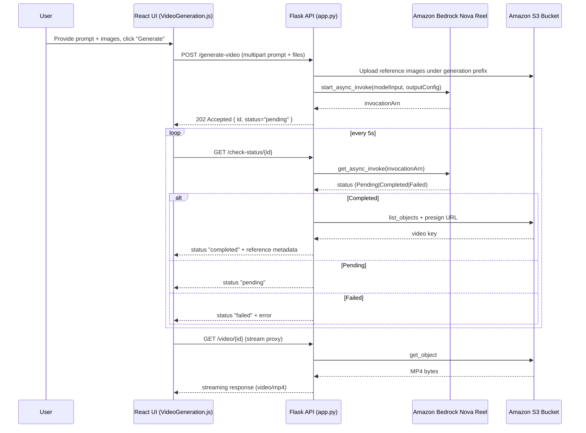

# AI-Powered Video Creation from Image – Architecture & Logic Reference

*Last updated:* 2 Dec 2025

## 1. Purpose & Scope
This document captures the end-to-end design for MediaGenAI's image-informed Generative Video experience. It covers both the Flask backend (`videoGeneration/app.py`) and the React frontend (`frontend/src/VideoGeneration.js`), detailing control flow, AWS service dependencies, API contracts, and operational considerations so future engineers can extend or troubleshoot the feature quickly.

## 2. High-Level Summary
- **What it does:** Converts natural-language prompts plus optional reference images into six-second videos using Amazon Bedrock's Nova Reel foundation model, stores renditions and supporting assets in Amazon S3, and surfaces finished clips via the web UI with historical context and reference galleries.
- **How it works:**
  1. Frontend bundles the user's prompt and up to four reference images into a multipart request.
  2. Flask uploads the reference images to S3, folds their filenames into the Nova Reel prompt, and launches an asynchronous `start_async_invoke` call that targets a per-job S3 prefix.
  3. Backend records the new job in an in-memory history list with `pending` status alongside metadata about the reference images.
  4. Frontend polls `/check-status/<id>` until the job completes, then streams the generated MP4 through the backend proxy.
  5. History and current result cards let users review prompts, inspect the reference gallery, or prune outputs.

### 2.1 Sequence Overview


## 3. Backend Service (`videoGeneration/app.py`)

### 3.1 Technology Stack & Bootstrap
- **Framework:** Flask with CORS enabled via `flask_cors.CORS` to support the React origin.
- **AWS Clients:** `boto3` for `bedrock-runtime` (model invocation) and `s3` (storage).
- **Configuration:**
  - `AWS_REGION` env variable (default `us-east-1`).
  - `VIDEO_GEN_S3_BUCKET` env variable (default `mediagenai-video-generation`).
  - `VIDEO_GEN_MAX_REFERENCE_IMAGES` (default `4`) to cap uploads.
  - `VIDEO_GEN_REFERENCE_TTL_SECONDS` (default `604800`) for presigned reference URLs.
- **Startup:** Ensures S3 bucket existence on launch via `ensure_s3_bucket()`.

### 3.2 Core Endpoints
| Endpoint | Method | Purpose | Key Logic |
|----------|--------|---------|-----------|
| `/health` | GET | Liveness probe | Returns region and bucket metadata. |
| `/generate-video` | POST | Kick off async gen | Accepts prompt and optional reference images via multipart form-data, uploads images to S3, builds enriched prompt, assigns UUID, sets random seed, invokes Nova Reel `start_async_invoke`, records job in `GENERATION_HISTORY`. |
| `/check-status/<id>` | GET | Poll job status | Reads history entry; if still pending, calls `get_async_invoke` and updates status. On completion, locates MP4 in S3, presigns video + reference thumbnails, and returns them. |
| `/history` | GET | Fetch recent jobs | Returns non-failed entries in `GENERATION_HISTORY`, each with reference metadata and signed URLs. |
| `/history/<id>` | DELETE | Remove job from history | Pops entry; optionally deletes S3 objects (video + reference images) via `delete_s3=true`. |
| `/video/<id>` | GET | Stream generated video | Proxies S3 object to avoid CORS/expiry issues; requires completed status. |

### 3.3 State Management
- **`GENERATION_HISTORY`:** In-memory list storing dictionaries (`id`, `prompt`, `status`, `invocation_arn`, timestamps, reference image metadata, etc.).
  - Pros: zero external dependencies, simple.
  - Cons: resets on service restart; consider DynamoDB or RDS for persistence if uptime matters.

### 3.4 AWS Interactions
- **Nova Reel (`amazon.nova-reel-v1:0`):**
  - Called asynchronously with the enriched text prompt and configuration (24 FPS, 6 seconds, 1280x720).
  - `start_async_invoke` returns `invocationArn` for polling.
  - `get_async_invoke` used for status; statuses `Completed`, `Failed`, or `InProgress` (treated as pending).
- **Amazon S3:**
  - Output prefix `generated-videos/{generation_id}/` houses `manifest.json`, MP4, and a `references/` subfolder for uploaded images.
  - `upload_fileobj` uploads each reference image with content-type metadata for later rendering.
  - `list_objects_v2` locates the MP4 asset.
  - `generate_presigned_url` issues time-bound HTTPS access for both the MP4 and the stored reference images (default 7 days, configurable).
  - `/video/<id>` proxies object to mask presigned URLs from the browser and provide streaming headers.

### 3.5 Error Handling
- Client-side validation: ensures a prompt or at least one reference image is provided (both empty requests are rejected).
- Reference upload errors: surface immediately with actionable messaging; partial successes still register valid files.
- AWS errors: surfaces `ClientError` codes to client, logs stacktrace.
- S3 listings: explicit error when video missing to help debugging.
- `/check-status`: gracefully handles unknown IDs and failed jobs without 500s.
- Logging: uses `app.logger` for operation traces, useful when backing service is run under `gunicorn` or `uwsgi`.

### 3.6 Security & Compliance
- **Authentication:** None currently; assume trusted internal usage. Add JWT/API key before production exposure.
- **IAM:** Service role must allow Bedrock `InvokeModelAsync`, S3 `PutObject/GetObject/ListBucket/DeleteObject` on `VIDEO_GEN_S3_BUCKET`.
- **CORS:** Enabled for all origins; tighten once frontend domain is fixed.

### 3.7 Operational Considerations
- **Async latency:** Nova Reel jobs may take 1–2 minutes; ensure frontend polling interval balances UX and request cost.
- **Scaling:** Flask app is stateless except for in-memory history. Add cache store (Redis/DynamoDB) if multiple replicas run behind a load balancer.
- **Observability:** Extend logging with structured metadata or integrate CloudWatch for production traces.
- **Cleanup:** No background worker removes stale S3 outputs. Schedule lifecycle rules or periodic cleanup to clear videos and reference folders.

## 4. Frontend Client (`frontend/src/VideoGeneration.js`)

### 4.1 User Experience Flow
1. **Brief design:** Users describe the motion in a text area and optionally upload up to four reference images (each capped at 8 MB). The generate button enables when either a prompt or images exist.
2. **Generation trigger:** FormData POST to `/generate-video`; when accepted, UI shows info banner and spinner.
3. **Polling:** `setInterval` (5s) hits `/check-status/{id}` until `completed` or `failed` state.
4. **Playback:** On success, video element streams `GET /video/{id}` (backend proxy) with autoplay + loop while the prompt and reference gallery render below.
5. **History:** Card grid displays all non-failed runs, each showing prompt fallback text, timestamp, resolution, and thumbnail strip of reference images.
6. **Deletion:** Trash button issues DELETE; confirmation guard prevents accidental loss. If the current video matches the deleted entry, the preview resets.

### 4.2 Component Responsibilities
- **State:** `prompt`, `referenceImages`, `generating`, `message`, `currentVideo`, `history` tracked via `useState`.
- **File handling:** Local previews generated via `FileReader` to present thumbnails before upload; validation enforces mime type and size limits.
- **Effects:** `useEffect(loadHistory)` on mount; no WebSocket usage, purely polling.
- **Styling:** Styled-components shaping sections, upload dropzone, previews, reference gallery, history cards, and spinner states.
- **Error Surfaces:** Single `Message` banner reflects errors/info/success returned by backend.

### 4.3 API Integration Details
- **Constants:** `BACKEND_URL = 'http://localhost:5009'`; adjust for production builds via environment variables or reverse proxy.
- **Multipart payload:** Prompt placed in `formData.append('prompt', value)`; each reference image appended under the `images` field.
- **Polling lifecycle:** Clears interval on completion or error to avoid leaks.
- **History refresh:** After each success or deletion, refetches `/history` ensuring UI stays in sync with backend memory (including reference URLs).
- **Cross-origin playback:** `crossOrigin="anonymous"` ensures the video tag handles proxied responses from Flask.

### 4.4 UX Enhancements Worth Considering
- Drag-and-drop uploads plus duplicate detection.
- Per-image captions or weighting controls that feed the backend prompt enrichment.
- Download button using `/video/<id>` and shareable deep links referencing stored reference galleries.
- Failure diagnostics that surface AWS `failureMessage` inline.

## 5. Data & Control Flow Details

### 5.1 Request Lifecycle
1. **Brief submission** → `POST /generate-video`
   - Validates presence of prompt or reference images, uploads files, builds enriched prompt, seeds job, returns job ID plus reference metadata (filenames, presigned URLs once available).
2. **Polling** → `GET /check-status/{id}`
   - Pending: returns `status: "pending"`.
   - Completed: includes `video_url`, `resolution`, `duration`, and presigned URLs for reference images.
   - Failed: returns `status: "failed"` and error reason.
3. **Streaming** → `GET /video/{id}`
   - Streams MP4 through Flask after verifying job completion.

### 5.2 Data Shapes
- **Generation entry:**
  ```json
  {
    "id": "uuid",
    "prompt": "Describe...",
    "status": "pending|completed|failed",
    "invocation_arn": "arn:aws:bedrock:...",
    "timestamp": "2025-12-02T02:15:01.234567",
    "duration": 6,
    "resolution": "1280x720",
    "video_url": "https://s3-presigned-url" (when completed),
    "s3_key": "generated-videos/<id>/output.mp4",
    "reference_images": [
      {
        "s3_key": "generated-videos/<id>/references/f93c.png",
        "filename": "shot-1.png",
        "content_type": "image/png",
        "url": "https://s3-presigned-url"
      }
    ]
  }
  ```
- **Frontend history card:** Reuses the same entry; displays prompt (or fallback text), timestamp, resolution, and renders up to three reference thumbnails.

### 5.3 Failure Modes & Recovery
- **AWS throttling:** `ClientError` surfaces to client; UI banner shows message; user can retry.
- **Reference upload failures:** Errors returned before invoking Nova so users can fix files and resubmit.
- **Missing outputs:** If S3 listing finds no MP4, backend returns 500 with diagnostic logging; investigate Nova job outputs.
- **Service restart:** History resets; consider persisting to durable store if this is an issue.
- **Expired presigned URLs:** Reference URLs include TTL; `/check-status` and `/history` regenerate fresh links on each request.

## 6. Deployment & Environment Guidance
- **Backend:** Package as Docker or run with `gunicorn`. Ensure environment vars and AWS credentials are injected.
- **Frontend:** Build with `npm run build`; host behind CDN or same domain. Configure reverse proxy (e.g., Nginx) to forward `/video-generation` routes to Flask service or adjust `BACKEND_URL`.
- **TLS & Domains:** Use HTTPS for both frontend and backend; presigned URLs function over HTTPS.
- **CI/CD:** Add automated tests (unit + smoke) before shipping to production. Currently manual testing only.

## 7. Extensions & Roadmap Ideas
- Persist generation history in DynamoDB (id, prompt, timestamps, reference metadata, status) for cross-instance resilience.
- Introduce WebSocket or Server-Sent Events to push status updates instead of polling.
- Allow users to configure video duration/resolution from UI and bubble to `videoGenerationConfig`.
- Add job cancellation endpoint invoking `stop_async_invoke` (when Bedrock supports it).
- Map each reference image to a semantic role (e.g., hero shot, typography) and feed structured context to Nova.
- Schedule S3 lifecycle policy to transition old videos and reference folders to Glacier or delete automatically.

## 8. Quick Start Checklist
1. **Prereqs:** AWS credentials with Bedrock + S3 permissions; S3 bucket exists or let service create it.
2. **Backend:**
   ```bash
   export AWS_REGION=us-east-1
   export VIDEO_GEN_S3_BUCKET=mediagenai-video-generation
   python3 videoGeneration/app.py
   ```
3. **Frontend:**
   ```bash
   cd frontend
   npm install
   npm start
   ```
4. **Test:** Visit `http://localhost:3000`, navigate to **AI-Powered Video Creation from Image**, describe a motion and/or upload images, wait for completion, and verify playback + reference gallery.

## 9. Contacts & Ownership
- **Service owner:** MediaGenAI GenAI Platform squad.
- **Primary modules:** `videoGeneration/app.py`, `frontend/src/VideoGeneration.js`.
- **Logging:** Check `video-generation.log` (root folder) for backend traces.
- **AWS resources:** Bedrock model `amazon.nova-reel-v1:0`; S3 bucket `${VIDEO_GEN_S3_BUCKET}` under account-specific ID.
